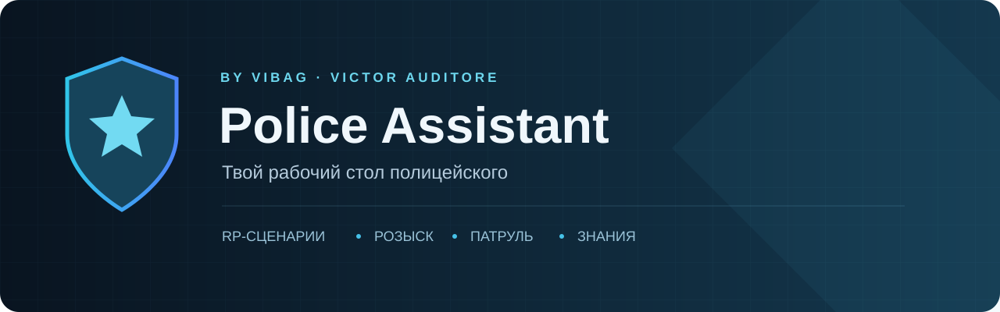
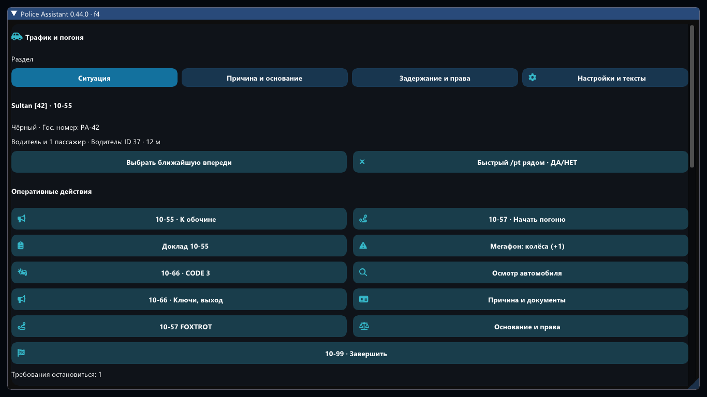
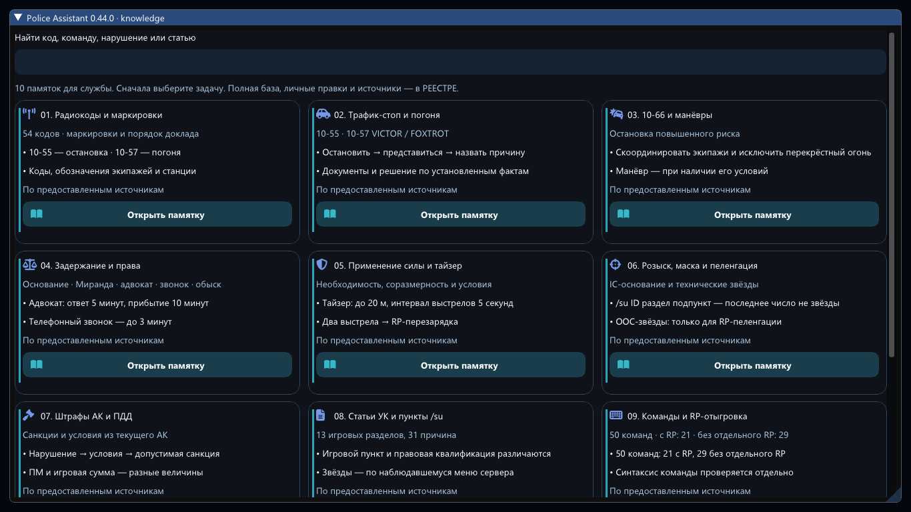
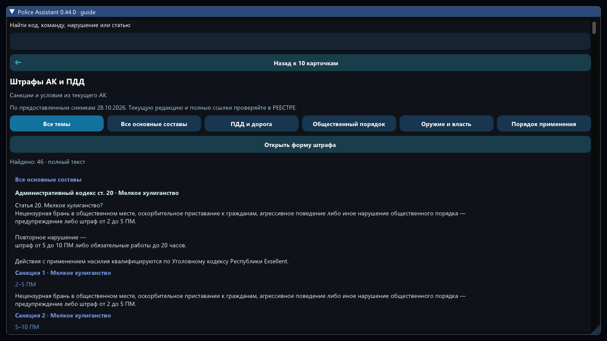
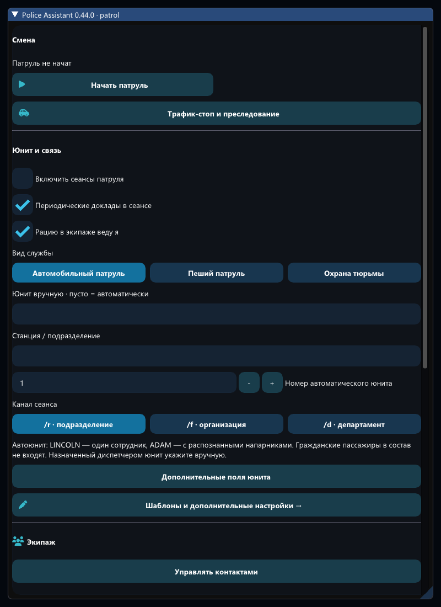

### Всё необходимое полицейскому — под рукой, прямо в игре.

**Патруль · Остановки и погони · RP-сценарии · Розыск · Рация · Справочники**

**[⬇ Скачать и установить](https://github.com/VIBAG-bg/Police-Assistant/releases/latest)** · **[📖 Руководство](docs/GUIDE.md)** · **[🔄 Обновления](docs/UPDATES.md)**

---

## Что такое Police Assistant?

**Police Assistant (PA)** — бесплатный помощник для сотрудников полиции на **Exsellent RP (GTA San Andreas / SA:MP)**.

Во время патруля не хочется вспоминать нужную команду, листать форум в поисках статьи или заново набирать длинный доклад. PA собирает эти вещи в одном месте: подсказывает, помогает подготовить действие и оставляет решение за тобой.

Это **помощник, а не бот для автоматической игры**. Ты управляешь персонажем, выбираешь действия и отвечаешь за соблюдение правил сервера.

## Как выглядит PA

*Трафик и погоня: информация о машине, требования остановиться, доклады и действия для преследования.*

<strong>📸 Посмотреть ещё три скриншота: база знаний, статьи и патруль</strong>

### База знаний

Вместо поиска по десяткам страниц — короткие памятки по ситуациям и переход к подробным материалам.

### Справочник статей и штрафов

Можно найти нужную статью, прочитать условия и открыть форму штрафа.

### Начало патруля

Настрой экипаж, позывной, канал связи и начинай смену.

> **О скриншотах:** показан интерфейс **0.44.0**. Пока эта версия не опубликована в [Releases](https://github.com/VIBAG-bg/Police-Assistant/releases), некоторые окна установленной версии могут выглядеть иначе.

## Что можно делать

| Возможность | Чем помогает |
| :--- | :--- |
| 🚔 **Остановка и погоня** | Работа с водителем, требования через мегафон, коды 10-55 и 10-57, доклады и переход к преследованию. |
| 📻 **Патруль и рация** | Начало и завершение смены, юнит, экипаж, каналы связи, готовые доклады и тревожные сообщения. |
| 🎭 **RP-сценарии и бинды** | Свои отыгровки, команды, паузы и условия. Можно менять тексты, назначать клавиши и добавлять действия на колесо. |
| 🎯 **Выбор игрока** | Быстрый выбор человека или машины рядом, контекстные действия и работа с выбранной целью. |
| 🪪 **Розыск и процедуры** | Помощники для `/su`, `/setmark`, штрафов, проверки документов и других служебных действий. |
| 📚 **База знаний** | Десять коротких памяток, поиск по радиокодам, статьям, командам и подробному реестру. |
| ⚙️ **Личные настройки** | Оформление, размеры окон, HUD, два отдельных колеса — пешком и в машине, а также собственные шаблоны. |

Большинство текстов и сценариев можно изменить прямо в игре. Не нравится готовая отыгровка? Открой редактор и сделай её своей.

## Начать просто

1. **[Скачай последнюю версию](https://github.com/VIBAG-bg/Police-Assistant/releases/latest)** — архив с названием `Police-Assistant-v…zip`. **Source code** для обычной установки не нужен.
2. **Закрой GTA** и распакуй скачанный ZIP целиком.
3. Запусти **`Установить PA.cmd`**, выбери папку игры и следуй подсказкам установщика.
4. Запусти игру, нажми **F9** и открой настройки своего профиля.

**Что потребуется:** Windows, GTA San Andreas / SA:MP и **MoonLoader 0.26**. Нужные Lua-библиотеки установщик может предложить докачать. Для Windows 7 есть [отдельная инструкция](docs/WINDOWS-COMPATIBILITY.md).

**[Подробная установка с картинками →](docs/INSTALLATION.md)**

### Первые кнопки, которые стоит запомнить

| Клавиша | Что открывает |
| :---: | :--- |
| **F9** | Главное окно PA: бинды, помощники, журнал, настройки и обновления |
| **F4** | Быстрые служебные помощники |
| **X — удерживать** | Радиальное меню; отпусти клавишу над нужным действием |
| **F10** | Быстрый список биндов |
| **F12** | Служебные памятки |

Клавиши можно переназначить. Для знакомства с отыгровками без отправки сообщений используй **F9 → Настройки → Профиль → Демо-режим**.

## Готовые бинды и настройки автора

При первой установке PA можно получить **готовый набор биндов и настроек**, включая RP-отыгровки, категории и расположение действий на колесе. Не придётся собирать всё с нуля — но любую часть можно переделать под себя.

Если PA уже установлен и хочешь взять свежий авторский набор:

1. Открой **F9 → Обновления PA**.
2. Выбери **«Обновить бинд-лист с GitHub»** и/или **«Обновить настройки с GitHub»**.
3. Прочитай подтверждение и реши, применять ли замену.

**Важно:** обновление **бинд-листа заменяет его целиком**, включая назначения колесу. Обновление **настроек** отдельно заменяет соответствующий авторский набор. Перед применением создаются резервные копии; личный профиль, заметки и контакты сохраняются.

**[Что входит в наборы и как они обновляются →](docs/AUTHOR-PRESETS.md)**

## Обновления программы и личные данные

Новая версия PA и авторские наборы — **разные обновления**. Обычное обновление программы не должно стирать твои бинды, тексты и настройки.

Проверить версию и запустить обновление можно в **F9 → Обновления PA**. Установка программных файлов выполняется после выхода из GTA; предусмотрены резервные копии и проверка пакета.

**[Как работает обновление →](docs/UPDATES.md)**

## Нужна помощь?

- **[Установка и требования](docs/INSTALLATION.md)** — что скачать и куда установить.
- **[Руководство по PA](docs/GUIDE.md)** — все окна, клавиши и примеры работы.
- **[Бинды и свои сценарии](docs/BINDS-AND-DATA.md)** — создание, редактирование и обмен.
- **[Розыск и /su](docs/WANTED.md)** — оформление и подтверждения.
- **[Частые проблемы](docs/TROUBLESHOOTING.md)** — если PA не запускается или что-то работает не так.
- **[История изменений](CHANGELOG.md)** — что появилось в последних версиях.

Нашёл ошибку или придумал полезную функцию? **[Напиши об этом в Issues](https://github.com/VIBAG-bg/Police-Assistant/issues)**. Укажи версию PA и шаги, после которых появляется проблема. Не прикладывай пароли и личные данные.

---

**Police Assistant — проект VIBAG · Victor Auditore**

*Сделано игроком для игроков Exsellent RP.*

PA — неофициальный пользовательский проект, не связанный с администрацией Exsellent RP, Rockstar Games или SA:MP. Правила сервера и актуальные редакции документов имеют приоритет над любыми подсказками помощника.

